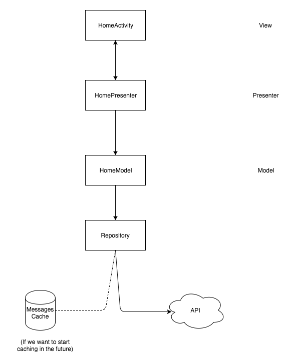

## Fortune-Cookie
Android app **Fortune Cookie** is an advice-on-demand provider. 

### Fortune Cookie architecture

The app follows a Model-View-Presenter (MVP) architecture pattern. 
The android activity functions as the view, the presenter holds all the business logic where as the model has the required data.
The model works with the Repository which abstracts out the data source, in our case, the API. 
In the future, if we would liketo introduce caching of the messages, the model and the higher up components 
need not worry about any implementation changes.

Dependency injection of views was achieved using the simple ButterKnife library. Dependency injection of the components
was done using the Dagger 2 library. 

### Other tools used on the project
* RxJava & RxAndroid
* Retrofit
* Dagger 2
* Butterknife
* Timber
* Mockito & Espresso (Unit & Automation testing, respectively)

